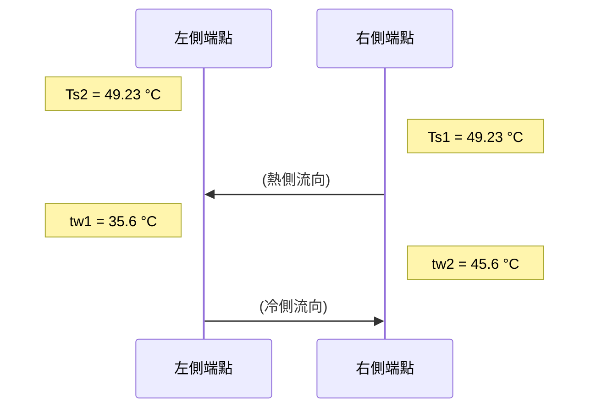

# 中龍鋼鐵冷凝器熱力計算書 (DRAGON STEEL PROJECT-REV.0)

## 1. 冷凝器熱負荷 (CONDENSER DUTY) : $Q \text{ (KCAL/HR)}$
* **計算公式：** $Q = W_s \times (I - t_s)$
* **參數：**
    * $W_s = 248,020 \text{ KG/HR}$ (Steam Flow Rate / 蒸汽流量)
    * $I = 487.00 \text{ KCAL/KG}$ (Enthalpy of Steam / 蒸汽熱焓值)
    * $t_s = 49.23 \text{ °C}$ (Steam Saturation Temperature / 蒸汽飽和溫度)
* **結果：** $Q = 108,575,715.4 \text{ KCAL/HR}$

## 2. 冷卻水需求量 (REQUIRED COOLING WATER) : $W \text{ (KG/HR)}$
* **計算公式：** $W = \frac{Q}{(t_{w2} - t_{w1}) \times C_p}$
* **參數：**
    * $C_p = 1 \text{ KCAL/KG°C}$ (Specific Heat of Water / 水比熱)
    * $t_{w1} = 35.6 \text{ °C}$ (Cooling Water Inlet Temp / 冷卻水入口溫度)
    * $t_{w2} = 45.6 \text{ °C}$ (Cooling Water Outlet Temp / 冷卻水出口溫度)
* **結果：** $W = 10,750 \text{ TON/HR}$

## 3. 對數平均溫差 (LMTD) $\text{ (°C)}$
* **溫度分布圖示：**

* **計算公式：** 
  $$ LMTD = \frac{(T_{s1} - t_{w2}) - (T_{s2} - t_{w1})}{\ln \left( \frac{T_{s1} - t_{w2}}{T_{s2} - t_{w1}} \right)} $$

* **計算過程：**
  $$ LMTD = \frac{(49.23 - 45.6) - (49.23 - 35.6)}{\ln \left( \frac{49.23 - 45.6}{49.23 - 35.6} \right)} $$

* **結果：** $LMTD = 7.56 \text{ °C}$

## 4. 熱傳導率 (HEAT TRANSFER RATES) : $K_o \text{ (KCAL/M}^2 \text{ HR °C)}$

### 4.1 基本熱傳係數 (HEAT TRANSFER COEFFICIENT) : $U$
* **參數：**
    * $U = 706.51 \text{ BTU/FT}^2 \text{ HR °C}$ (By Interpolation)
    * 流速 $V = 2.200 \text{ M/S} = 7.219 \text{ FT/S}$

### 4.2 管材修正係數 (CORRECTION FACTOR FOR TUBE MATERIAL)
* $K_{1a} = 1.007$ (關於 C4430T，由 Table 3 取得)
* $K_{1b} = 0.908$ (關於 C7150T，由 Table 3 取得)

### 4.3 入口水溫修正係數 (INLET WATER TEMPERATURE CORRECTION FACTOR)
* $t_{w1} = 35.6 \text{ °C} = 96.1 \text{ °F}$
* $K_2 = 1.096$ (由 Fig.2 / Table 2 內插取得)

> **📝 表格參考說明：**
> 上述提到的 `Table 2`, `Table 3`, 與 `Fig 2`，為熱交換器領域常見的 **HEI (Heat Exchange Institute) Standards for Steam Surface Condensers (蒸汽表面冷凝器標準)** 內的標準查表數據。

### 4.4 清潔係數 (CLEANLINESS FACTOR)
* $F = 0.85$ (代表管束預期維持 85% 的清潔度)

### 4.5 熱傳導率計算 (HEAT TRANSFER RATES)
* **單位轉換備註：** $1 \text{ BTU/FT}^2 \text{ HR °C} = 4.882 \text{ KCAL/M}^2 \text{ HR °C}$ (圖面下方亦有標示 4.883 轉換基準)
* **污垢係數備註：** 公式中的 `FOULING FACTOR` (污垢熱阻) 在原計算書的變數列表中未明確宣告其數值，但已隱含於分母的計算內。
* **C4430T 管材熱傳導率 ($K_{oa}$)：**
  $$ K_{oa} = \frac{1}{\frac{1}{U \times K_{1a} \times K_2 \times F \times 4.882} + \text{FOULING FACTOR}} = 3219.18 \text{ KCAL/M}^2 \text{ HR °C} $$
* **C7150T 管材熱傳導率 ($K_{ob}$)：**
  $$ K_{ob} = \frac{1}{\frac{1}{U \times K_{1b} \times K_2 \times F \times 4.882} + \text{FOULING FACTOR}} = 2902.69 \text{ KCAL/M}^2 \text{ HR °C} $$
* **綜合總熱傳導率 ($K_o$)：**
  $$ K_o = K_{oa} \times \left( \frac{\text{C4430T Tube NO.}}{\text{Total Tube NO.}} \right) + K_{ob} \times \left( \frac{\text{C7150T Tube NO.}}{\text{Total Tube NO.}} \right) $$
  $$ K_o = 3197.02 \text{ KCAL/M}^2 \text{ HR °C} $$

## 5. 所需表面積 (REQUIRED SURFACE AREA)
* **計算公式：** $A_e = \frac{Q}{K_o \times LMTD}$
* **結果：** $A_e = 4493.3 \text{ M}^2$

## 6. 實際使用面積 (USED SURFACE AREA)
* $A_u = 4560 \text{ M}^2$

## 7. 設計裕度 (OVERDESIGN)
* **計算公式：** $O_d = \frac{A_u - A_e}{A_e} \times 100\%$
* **計算過程：** $\frac{4560 - 4493.3}{4493.3} \times 100\% \approx 1.484\%$
* **結果：** $O_d = 1.49 \%$

## 8. 冷凝器尺寸與規格 (CONDENSER DIMENSIONS)
* **NO. OF PASS (流程數):** 2
* **NO. OF TUBE (總管數):** 6312 支
  * C4430T Tube NO.: 5870 支
  * C7150T Tube NO.: 442 支
* **WATER BOX I.D (水箱內徑):** 3400 mm
* **SHELL I.D (殼體內徑):** 4150 mm
* **TUBE LENGTH (管長):** 9054 mm (EFFECTIVE / 有效長度)